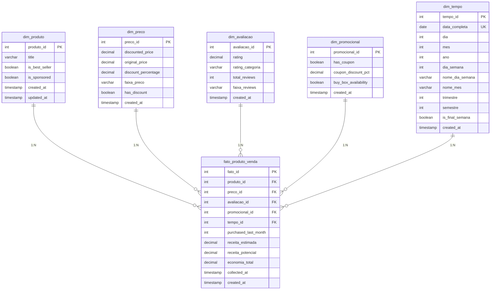

# Diagrama MER - Star Schema Amazon Products

## Diagrama Entidade-Relacionamento (Mermaid)



## Diagrama Simplificado (Star Schema)

```
                         DIM_TEMPO
                             |
                             |
    DIM_PRODUTO -------- FATO_PRODUTO -------- DIM_PRECO
                        VENDA
                             |
                             |
                   +---------+---------+
                   |                   |
            DIM_AVALIACAO      DIM_PROMOCIONAL
```

## Relacionamentos

### Cardinalidades

| Dimensão | Cardinalidade | Fato |
|----------|---------------|------|
| dim_produto | 1 | N (fato_produto_venda) |
| dim_preco | 1 | N (fato_produto_venda) |
| dim_avaliacao | 1 | N (fato_produto_venda) |
| dim_promocional | 1 | N (fato_produto_venda) |
| dim_tempo | 1 | N (fato_produto_venda) |

### Descrição dos Relacionamentos

1. **dim_produto → fato_produto_venda**
   - Um produto pode aparecer em múltiplas vendas
   - Cada venda refere-se a um único produto

2. **dim_preco → fato_produto_venda**
   - Uma combinação de preços pode ser usada em múltiplas vendas
   - Cada venda tem uma única configuração de preço

3. **dim_avaliacao → fato_produto_venda**
   - Uma combinação de rating/reviews pode estar em múltiplas vendas
   - Cada venda tem uma única configuração de avaliação

4. **dim_promocional → fato_produto_venda**
   - Uma configuração promocional pode estar em múltiplas vendas
   - Cada venda tem uma única configuração promocional

5. **dim_tempo → fato_produto_venda**
   - Uma data pode ter múltiplas vendas
   - Cada venda ocorre em uma única data

## Normalização

### Nível de Normalização: 3NF nas Dimensões

**Justificativa para Star Schema (Desnormalização Controlada):**
- ✅ Melhor performance em queries analíticas
- ✅ Simplicidade para usuários de negócio
- ✅ Facilita criação de relatórios
- ✅ Otimizado para leitura (OLAP)

### Campos Calculados (Redundância Controlada)

Na tabela fato, mantemos campos calculados para performance:
- `receita_estimada` = `purchased_last_month` × `discounted_price`
- `receita_potencial` = `purchased_last_month` × `original_price`
- `economia_total` = `receita_potencial` - `receita_estimada`

**Justificativa:** Evitar cálculos repetidos em queries agregadas

## Índices e Otimização

### Índices Primários
- Todas as PKs têm índice automático (B-Tree)

### Índices Secundários

**Dimensões:**
```sql
-- dim_produto
CREATE INDEX idx_dim_produto_title ON dim_produto(title);
CREATE INDEX idx_dim_produto_best_seller ON dim_produto(is_best_seller);

-- dim_preco
CREATE INDEX idx_dim_preco_faixa ON dim_preco(faixa_preco);
CREATE INDEX idx_dim_preco_discount ON dim_preco(has_discount);

-- dim_avaliacao
CREATE INDEX idx_dim_avaliacao_rating ON dim_avaliacao(rating);
CREATE INDEX idx_dim_avaliacao_categoria ON dim_avaliacao(rating_categoria);

-- dim_promocional
CREATE INDEX idx_dim_promocional_coupon ON dim_promocional(has_coupon);

-- dim_tempo
CREATE INDEX idx_dim_tempo_data ON dim_tempo(data_completa);
CREATE INDEX idx_dim_tempo_ano_mes ON dim_tempo(ano, mes);
```

**Tabela Fato:**
```sql
-- Índices simples (para JOINs)
CREATE INDEX idx_fato_produto ON fato_produto_venda(produto_id);
CREATE INDEX idx_fato_preco ON fato_produto_venda(preco_id);
CREATE INDEX idx_fato_avaliacao ON fato_produto_venda(avaliacao_id);
CREATE INDEX idx_fato_promocional ON fato_produto_venda(promocional_id);
CREATE INDEX idx_fato_tempo ON fato_produto_venda(tempo_id);

-- Índices compostos (para queries comuns)
CREATE INDEX idx_fato_produto_tempo ON fato_produto_venda(produto_id, tempo_id);
CREATE INDEX idx_fato_tempo_produto ON fato_produto_venda(tempo_id, produto_id);
CREATE INDEX idx_fato_collected_at ON fato_produto_venda(collected_at);
```

## Estimativa de Tamanho

### Dimensões (Crescimento Lento)

| Tabela | Registros Estimados | Tamanho Aprox. |
|--------|---------------------|----------------|
| dim_produto | 30.000 | 5 MB |
| dim_preco | 5.000 | 500 KB |
| dim_avaliacao | 2.000 | 200 KB |
| dim_promocional | 8 | 1 KB |
| dim_tempo | 3.650 (10 anos) | 500 KB |
| **Total Dimensões** | **~40.658** | **~6 MB** |

### Fato (Crescimento Rápido)

| Período | Registros Estimados | Tamanho Aprox. |
|---------|---------------------|----------------|
| Carga inicial | 30.000 | 10 MB |
| Por mês (novos) | 5.000 | 2 MB |
| Por ano | 60.000 | 24 MB |
| **10 anos** | **630.000** | **250 MB** |

**Total Estimado (10 anos):** ~256 MB

## Queries de Performance

### Query 1: Vendas por Faixa de Preço (Otimizada)
```sql
-- Usa índices: idx_fato_preco, idx_dim_preco_faixa
SELECT 
    dp.faixa_preco,
    SUM(f.purchased_last_month) as total_vendas,
    SUM(f.receita_estimada) as receita_total
FROM fato_produto_venda f
JOIN dim_preco dp ON f.preco_id = dp.preco_id
GROUP BY dp.faixa_preco
ORDER BY receita_total DESC;
```

### Query 2: Top Produtos do Mês (Otimizada)
```sql
-- Usa índices: idx_fato_tempo, idx_dim_tempo_ano_mes
SELECT 
    dprod.title,
    SUM(f.purchased_last_month) as vendas
FROM fato_produto_venda f
JOIN dim_tempo dt ON f.tempo_id = dt.tempo_id
JOIN dim_produto dprod ON f.produto_id = dprod.produto_id
WHERE dt.ano = 2025 AND dt.mes = 8
GROUP BY dprod.title
ORDER BY vendas DESC
LIMIT 10;
```

### Query 3: Efetividade de Cupons (Otimizada)
```sql
-- Usa índices: idx_fato_promocional, idx_dim_promocional_coupon
SELECT 
    dpm.has_coupon,
    COUNT(*) as produtos,
    AVG(f.purchased_last_month) as media_vendas
FROM fato_produto_venda f
JOIN dim_promocional dpm ON f.promocional_id = dpm.promocional_id
GROUP BY dpm.has_coupon;
```

## Manutenção

### Rotinas Recomendadas

```sql
-- Atualizar estatísticas (semanal)
ANALYZE fato_produto_venda;
ANALYZE dim_produto;

-- Vacuum (mensal)
VACUUM ANALYZE fato_produto_venda;

-- Reindex (trimestral)
REINDEX TABLE fato_produto_venda;
```

### Monitoramento

```sql
-- Verificar tamanho das tabelas
SELECT 
    tablename,
    pg_size_pretty(pg_total_relation_size(schemaname||'.'||tablename)) AS size
FROM pg_tables
WHERE schemaname = 'public'
ORDER BY pg_total_relation_size(schemaname||'.'||tablename) DESC;

-- Verificar uso de índices
SELECT 
    schemaname,
    tablename,
    indexname,
    idx_scan as index_scans,
    idx_tup_read as tuples_read
FROM pg_stat_user_indexes
ORDER BY idx_scan DESC;
```
